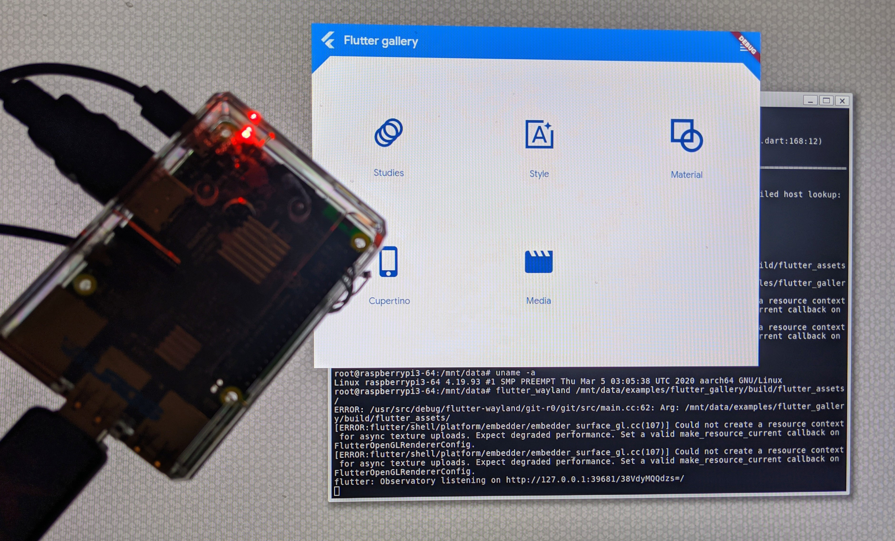

# meta-flutter

Yocto Layer for Flutter Engine

### Project Status

* Engine default build is beta/debug
* Includes third-party embedder recipes
* Validated on wide variety of targets

rpi3-64 running the Flutter Gallery App

## Overview

This layer includes recipes to build:
    
    flutter-engine (channel selection, default is beta)
    flutter-wayland (POC)
        waylandpp/ipugxml
    Sony embedders (less x11, and EGL streaming)
    flutter-pi
    rpi-vk-driver
    wayland glfw
    wlroots
    tinywl (wlroots MVP)

## Notes
    Sony only support weston-6.  They don't accept PRs yet.
    
## Layers used for building

    meta
    meta-poky
    meta-oe
    meta-multimedia
    meta-networking
    meta-perl
    meta-python
    meta-clang
